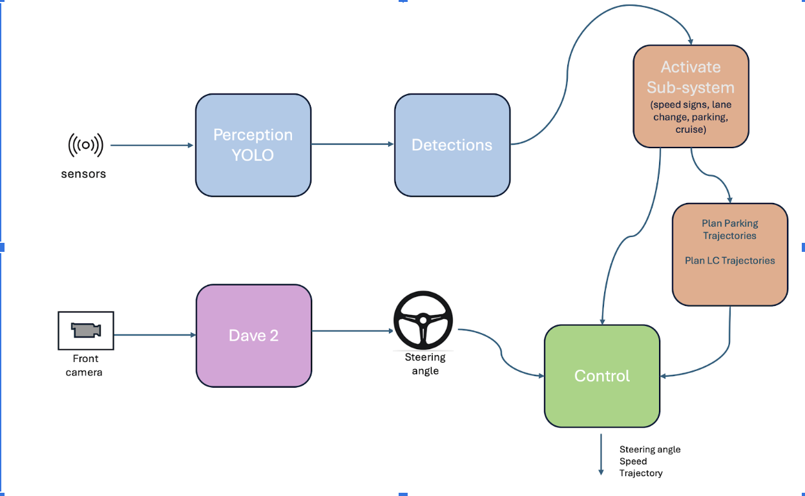
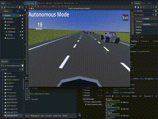

# Autonomous Car Project
In this project, we developed a simulation for autonomous driving using the Godot game engine. The system integrates state-of-the-art machine learning and computer vision techniques, including the Nvidia Dave-2 model for steering prediction  and YOLO(You Only Look Once) for object detection. The simulation consists of seven tracks designed to test various autonomous driving capabilities, such as lane merging, speed sign detection, obstacle avoidance, lane change and autonomous parking. The results of our test tracks showed great performance although the server side ran on CPU, with hardware which has a GPU compatible with Cuda, the performance will be better.

Here is and overview of the system

As you can see we used multiple machine learinig, image proccessing and computer vision models to implement such system.

We used Nvidia Dave-2 model for steering command prediction, we basicly trained a CNN to predict steering command, Data was collected using our simulation in Godot game Engine.
To connect between the worlds of AI models which all in pyhton and simulation which in C# we used Server-Client approach.
We ran a Server using Socketio and eventlet. The client(simulation) send requests to the server like steering command prediction and YOLO object detection. Server proccess this requests by running the relevant model for each request. When a result is aquired, the server will send back to the client, then changes we be applied.

For more information about the funcuality of each subsystem, you can check the report.pdf.

## Brief Footage Of Our System
Watch the Youtube video for more by clicking [here](https://youtu.be/6kBQ6Ja8XR0)
### Lane Change Subsystem Test

### Parking Subsystem Test

Check out runs folder for result of free-slot detections.

### Speed Sign detection Subsystem Test

## Run Project
There is 2 parts of running the project:
- Run the server:

       - Must initilazie an enviornment (follow the steps):

       -  # For windows:

              - 1. python -m venv my_env  # Replace 'my_env' with any name you want
              - 2. my_env\Scripts\activate
              - 3. py -3.10 -m venv my_env
              - 4. python --version  # Should show Python 3.10.x
              - 5. pip install -r requirements.txt
              - 6. to verfiy enter this command: python -c "import flask; import tensorflow; import ultralytics; print('All libraries installed successfully!')"
              - 7. run test.py

       - # For mac: 

              - 1. python3 -m venv my_env  # Replace 'my_env' with any name you want
              - 2. source my_env/bin/activate
              - 3. sudo apt update && sudo apt install python3.10 python3.10-venv -y  # For Debian/Ubuntu , brew install python@3.10  # For macOS (Homebrew users)
              - 4. python --version  # Should show Python 3.10.x
              - 5. pip install -r requirements.txt
              - 6. to verfiy enter this command: python -c "import flask; import tensorflow; import ultralytics; print('All libraries installed successfully!')"
              - 7. run test.py

- Run the simulation:
-To, lanuch the simulation, you will need to download Godot Mono using this [link for mac](https://godotengine.org/download/macos/), [link for windows](https://godotengine.org/download/windows/)
- Then you will need to download this github repository on your computer, and then open godot using the downloaded repository

## OverView about project files
- There are mulitple folders in this project:

       - Scripts: has all the code needed to implement the Godot simulation, computer vision and machine learning models, there are two notbooks, Dave-2 which we trained the steering prediction model, And YOLO model for free-slot and traffic signs detection model.

       - Scenes: has all the scence that we tested in our simulation.

       - Addons: containes all the asset libraries that we used in Godot Game engine.

       - Models: contain the model we trained and using.

       - Vechile: contains the body, wheels and texture.
       
       other folders contains texture and images.

       
       
